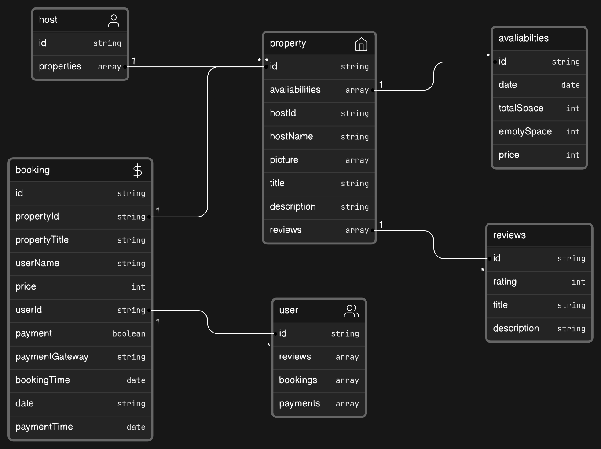

# Resort App

This is a repository for rental pools

### Data flow



### Setup .env file

```js
NODE_ENV ===

DATABASE_URL=
AUTH_SECRET=

GOOGLE_CLIENT_ID=
GOOGLE_CLIENT_SECRET=

RESEND_API_KEY=
NEXT_PUBLIC_APP_URL=http://localhost:3000
```

### Setup Prisma

```shell
npx prisma generate
npx prisma db push
```
